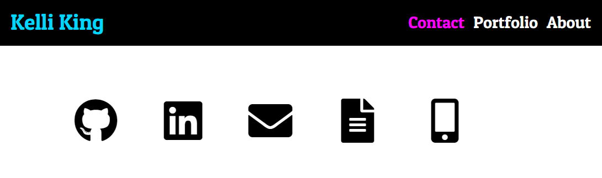
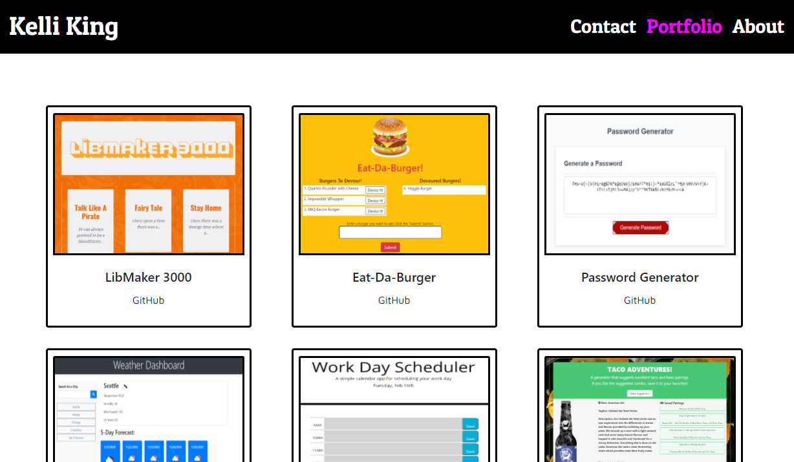

# Bootcamp Homework 02, 08, & 16 - CSS and Bootstrap: Responsive Portfolio

## My Portfolio

This is an assignment to create a mobile responsive portfolio using the Bootstrap CSS Framework.  Requirements for the portfolio include a consistent navbar across each page of the portfolio, a responsive layout, and responsive images, while limiting the use of media queries.  

### Homework Deliverables and Codebase Updates

* Created `index.html`, `portfolio.html` and `contact.html` files
* Linked all pages to external BootstrapCDN
* Linked additional CSS to each page
* Added the Bootstrap navbar elements to all pages to create a universal responsive navbar
* Right-aligned the page links within the navbar
* Updated href attributes on navbar links for links to be functional
* Utilized Bootstrap grid system to create the main content across all pages 
* Added portfolio project images to `./assets` folder
* Added alt attributes to the HTML img elements
* Added links to GitHub, LinkedIn, Email, and Project/Assignment urls
* Linked all pages to Google Fonts (Maven Pro and Patua One)
* Linked to Font Awesome for icons on `contact.html`
* Created a README.md file to describe and demo the code
* Deployed the application to a live URL 

## Screenshots

The following image shows the portfolio appearance and functionality:

## Application URL
* [Portfolio Index](https://thorgriffs.github.io/portfolio/index.html)
* [Portfolio Contact](https://thorgriffs.github.io/portfolio/contact.html)
* [Portfolio Page](https://thorgriffs.github.io/portfolio/portfolio.html)
