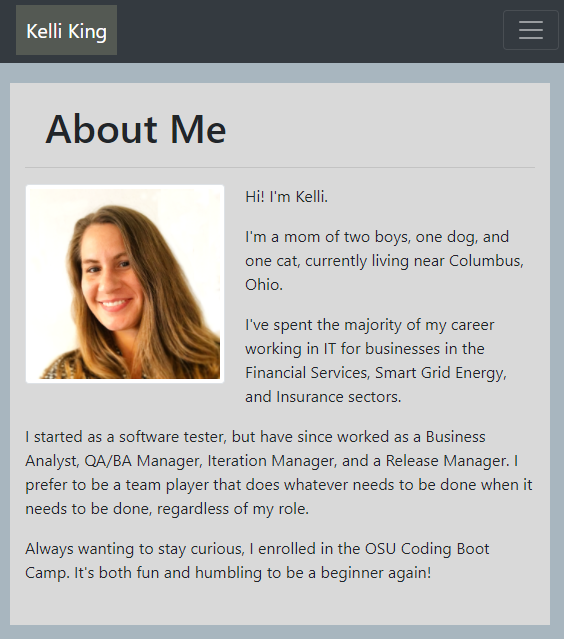
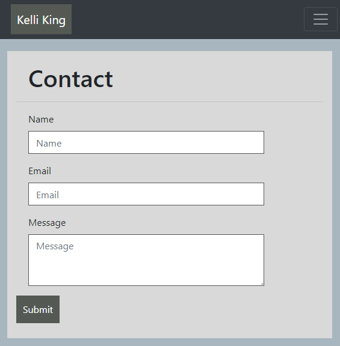
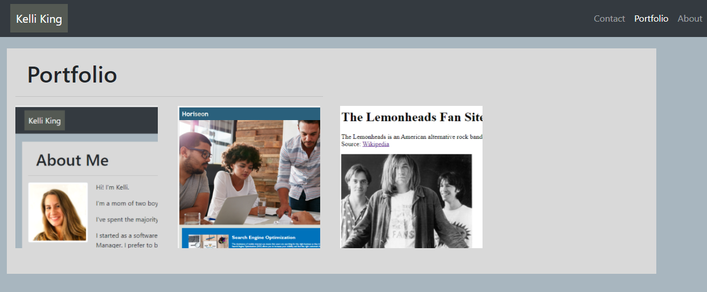

# Bootcamp Homework 02 - CSS and Bootstrap: Responsive Portfolio

## My Portfolio

This is an assignment to create a mobile responsive portfolio using the Bootstrap CSS Framework.  Requirements for the portfolio include a consistent navbar across each page of the portfolio, a responsive layout, and responsive images, while limiting the use of media queries.  

### Homework Deliverables and Codebase Updates

* Created `index.html`, `portfolio.html` and `contact.html` files
* Linked all pages to external BootstrapCDN
* Linked additional CSS to each page
* Added the Bootstrap navbar elements to all pages to create a universal responsive navbar
* Right-aligned the page links within the navbar
* Updated href attributes on navbar links for links to be functional
* Utilized Bootstrap grid system to create the main content across all pages 
* Added Bootstrap form elements to create the Contact form
* Added portfolio project images to `./assets` folder
* Added alt attributes to the HTML img elements
* Added (well, attempted to add) a universal footer across all pages
* Used an [HTML validation service](https://validator.w3.org/#validate_by_input) to ensure valid HTML
* Created a README.md file to describe and demo the code
* Deployed the application to a live URL

### Notes on this project

Using the Bootstrap CSS Framework for this project was both fun and frustrating. My expectations regarding the difficulty level of each of my tasks were incorrect, in ways that I found surprising:
* The form on the Contact page was far easier to work with than I expected. It was a welcome relief mid-project to find something that I did not struggle to implement.
* The Bootstrap grid system was more difficult to control than I expected.  The `.container` class with it's `.row` and `.col` children seemed very straight forward and almost simple in class.  But on execution in this project, I struggled with the placement of the content on the page.  
    * The content did not align the way I expected (on both the About and Portfolio pages).
    * The content did not wrap the way I expected (again, on both the About and Portfolio pages).
    * My attempts to use additional CSS to adjust margins/aligment/floats/etc proved complicated.
    * I chose to have the Portfolio img elements display horizontally across the screen (md & lg screens) for the time being since they did not have the correct placement/spacing when trying to display them in a two column grid.  Will continue to work through this issue to find a way to display them in two columns that does not render poorly.  
* The responsive navbar elements were really fun to work with until I tried to move the page links to the right side of the screen.  This, embarrissingly, took me a long time to figure out.  In the end, I updated `.mr-auto` to `.ml-auto` and learned my lesson to google solutions earlier going forward.
* The footer was more complex than I expected. I'm still unsure of how to make it function as a sticky footer. 
* Using the [HTML validation service](https://validator.w3.org/#validate_by_input) was very helpful and led to a correction of the `.form-control` id associations on the Contact form.
* The responsiveness of the page is still a bit off (the container extends past the view at certain sizes and the text moves outside of the containers, margins and alignment are also not the best depending on the screen size).  I'm hoping more practice will help me understand how to refine this functionality. 
* Choosing color schemes is difficult and not a natural talent for me. 

## Screenshot

The following image shows the portfolio appearance and functionality:

## Application URL
* [Portfolio Index](https://thorgriffs.github.io/portfolio/index.html)
* [Portfolio Contact](https://thorgriffs.github.io/portfolio/contact.html)
* [Portfolio Page](https://thorgriffs.github.io/portfolio/portfolio.html)